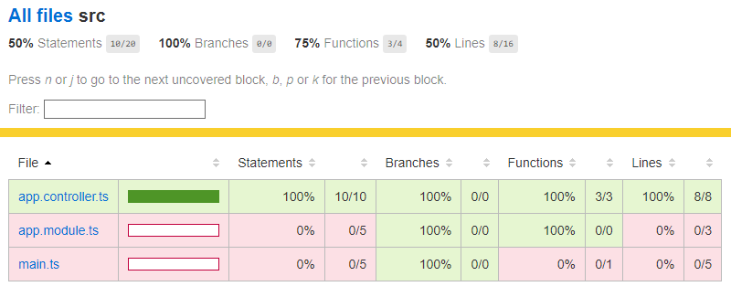
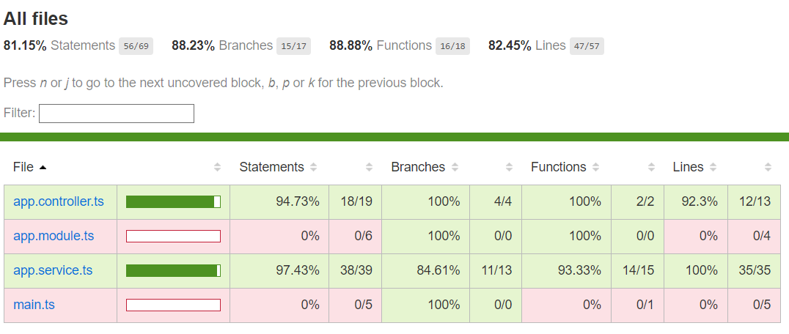

# NestJS Test

## Introduction

This project consists of two folders: `easy-one` and `challenge`. Each folder contains a separate app built with NestJS.

### easy-one

- Endpoint: `POST /json`
- Request: JSON payload of type `ses-sns-event.json`
- Response: JSON
- Unit testing coverage:

### challenge

- Endpoint: `GET /get-json`
- Query Parameters: `url` (URL or local path)
- Logic:
  - Read `.eml` file from the specified `url`
  - Look for an attached JSON file in the email
  - If found, return the JSON as a response
  - If not found, search for a JSON link in the email body
  - If found, return the JSON as a response
  - If no JSON link is found, search for JSON links in a web page
  - Return the first JSON found as a response
  - If no JSON links are found, return a 404 response
- Unit testing coverage:

## Installation

1. Clone the repository.
2. Navigate to the respective folder (`easy-one` or `challenge`).
3. Install the dependencies using the package manager of your choice (e.g., npm or yarn).
